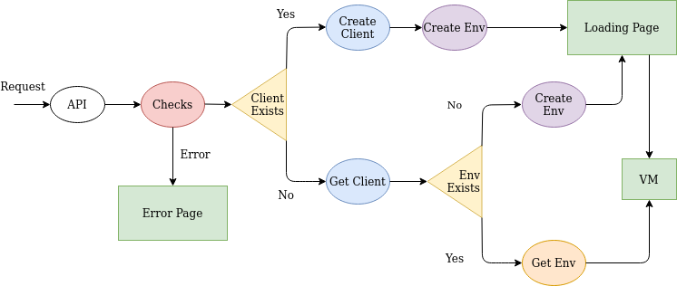

# Haaukins API

Haaukins API allows the user to connect directly Kali Linux VM avoiding normal Haaukins steps. Unlike Haaukins, in which
you need to have an event up and running in order to sign up and connect Kali Linux VM, on the API you just need to select
the challenges you want to have in your Environment and run it. In almost a minute the environment will be ready and the 
user will be automatically redirect to Guacamole which creates RDP connection through browser to Kali Linux VM.

### Keywords used on this repository
- **Client**: Identify (through session cookie containing an ID) who made the request on the API
- **Environment**: Identify the challenges requested from the Client. It contantains a guacamole instance, a lab and a timer.
- **Challenges**: They are Haaukins Exercises

The relation in between those 3 keywords is the following 
> Client 1 ----> N Environment 1 ----> M Challenges

### API implementation
The API has some constrains in order to don't create too many **Environments** and 
- the API has a maximum amount of requests that can handle (specified on the config file)
- a **Client** has a maximum amount of requests that can make (specified on the config file)
- the **Environment** will destroy itself after specified amount of time in source code

In case either a **Client** or the API reached the maximum amount of request, another request cannot be handled, therefore an 
error page will be showed. In case the next users have to wait that at the least one **Environment** will destroy itself.

### Configuration file
Example API configuration file: 
```yaml
host: # host
port:
  insecure: 80
  secure: 443
tls: 
  enabled: true
  certfile: # certificates absolute path
  certkey: # certificates absolute path
  cafile: # certificates absolute path
exercises-file: # string, absolute path to the exercise.yml file
ova-dir: # directory where to pull the .ova images
api:
  sign-key: whatever
  admin:
    username: whatever
    password: whatever
  captcha: 
    enabled: true
    site-key: whatever # captcha site key
    secret-key: whatever # captcha secret key
  total-max-requests: 20 # int, number of request the API can handle
  client-max-requests: 4 # int, number request a client can make
  frontend:
    image: kali
    memory: 4096
  store-file: whatever.csv # certificates absolute path of .csv file where to store the requests 
docker-repositories: 
  - username: whatever # registry username
    password: whatever # registry password
    serveraddress: registry.gitlab.com
```

### How it works (for developers)

When the API receives a request under this path `/api/`, it passes through a middleware that makes some check and initialise some variable.
The following schema explain how the middleware works.



1. API handle the request and checks (shows Error Page in case of error):
    - if the challenges TAG selected exists
    - if the API can handle another request
    - if the user is not a BOT through a reCAPTCHA
2. API check for a session cookie in order to check is a Client exists:
    - if exists it means a Client already made at the least a request, so the request is forwarded to step 3.
    - if not a new Client is created, new session cookie send as response and new Environment created (4)
3. Get the Client from the session cookie and:
    - check if the requested challenges are already running in an environment, if so redirect the Client to Kali Linux
    - if not create new Environment
